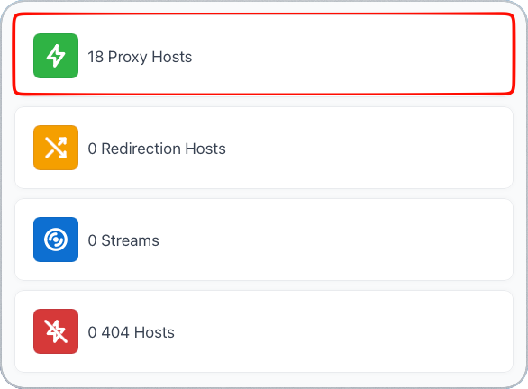
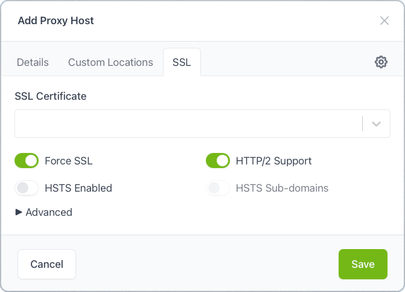
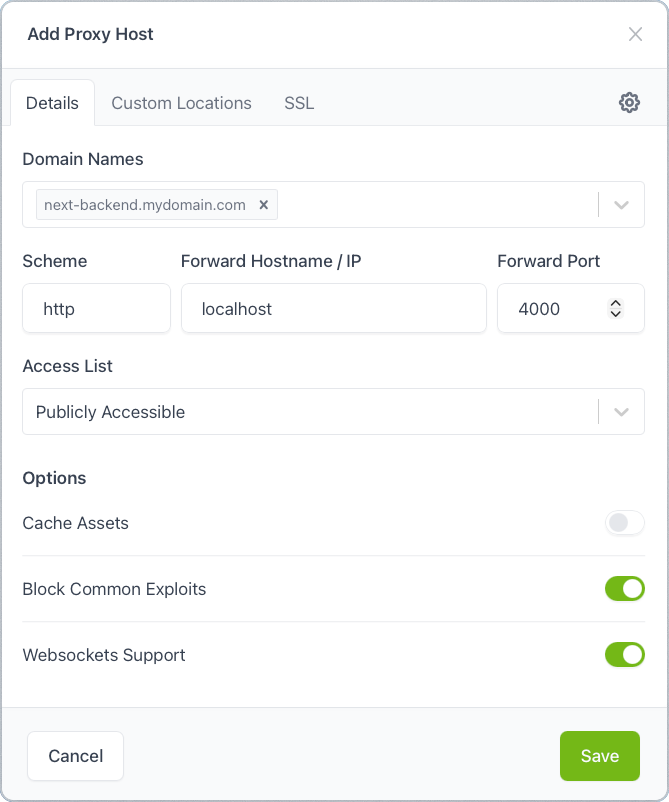

# Forwarding with Nginx Proxy Manager

If you want to forward htmlOS NEXT securely with a custom domain (e.g., `next.yourdomain.com`), you can route your traffic through **Nginx Proxy Manager (NPM)**.

This guide will walk you through configuring **htmlOS NEXT** to be forwarded by **NPM**.

## Step 1: Forward the frontend
Open your **Nginx Proxy Manager** interface and select **Proxy Hosts**.

Then click the **Add Proxy Host** button.

Then fill in the details:
- The domain name you wish to forward to
- The hostname and port where the frontend is located
- Block Common Exploits (optional)

If you want HTTPS support, switch to the **SSL** tab, and:
- Select your SSL certificate
- Enable **Force SSL**
- Enable **HTTP/2 Support**

Click the **Save** button.
## Step 2: Forward the backend

Click the **Add Proxy Host** button.

Then fill in the details:
- The domain name you wish to forward to
- The hostname and port where the backend is located
- Block Common Exploits (optional)
- Websockets Support (needed for the continuity feature)

If you want HTTPS support, switch to the **SSL** tab, and:
- Select your SSL certificate
- Enable **Force SSL**
- Enable **HTTP/2 Support**

Click the **Save** button.

## Step 3: Update the environment variables

On your Docker Compose file, change these variables:
- `FRONTEND_ADDRESSES`: To the domain you just gave the frontend.
- `VITE_BACKEND_ADDRESSES`: To the domain you just gave the backend.

Then restart your Docker Compose stack.

After these changes, you should now be able to access your **htmlOS NEXT** instance from your domain.